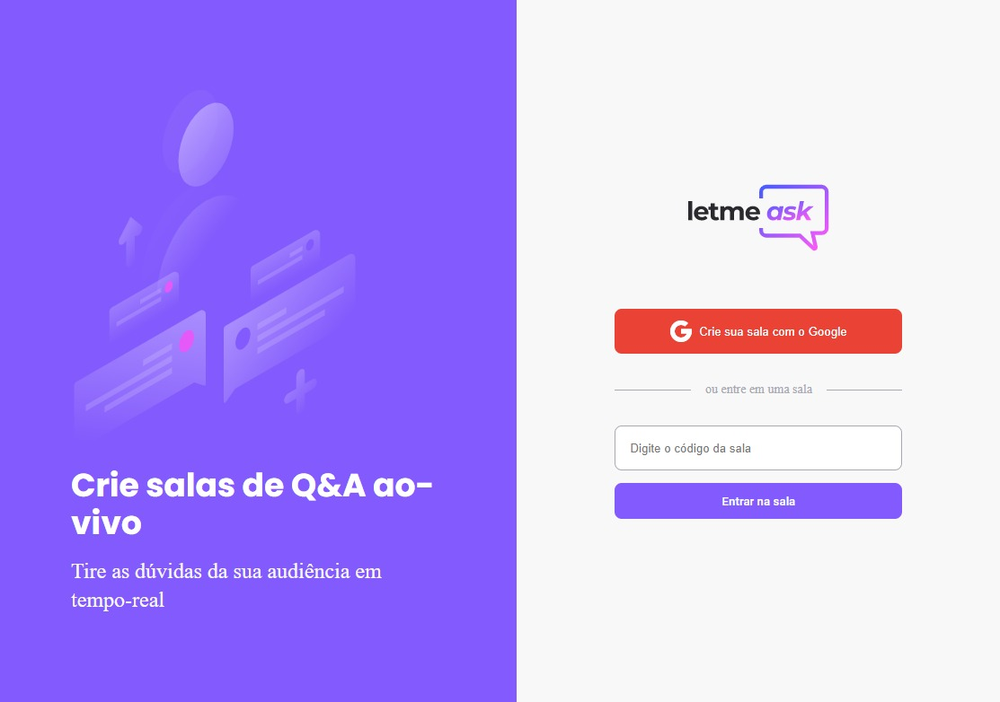

# letmeask

  

  
       
  

 

    

 

## Tecnologias

Esse projeto foi desenvolvido com:

- [React](https://reactjs.org)
- [TypeScript](https://www.typescriptlang.org)
- [Firebase](https://firebase.google.com)

---
<h2 align="center">Sobre 📖</h2>
   

   O projeto Letmeask foi desenvolvido na Next Level Week, Na trilha de Reacjs junto as aulas do Diego Fernandes. 
   Foram feitas alterações por mim, foi adicionado uma modal genérica de confirmação e exclusão de salas e perguntas no menu administrativo  
   e foi adicionado ajustes na responsividade da aplicação, o layout pode ser visto abaixo no figma.

---

<h2 align="center">Layout</h2>   
    
 
   - <a href="https://www.figma.com/file/kLK7FYnWKMoN68sQXcSniu/PayFlow">Figma</a> 
   

